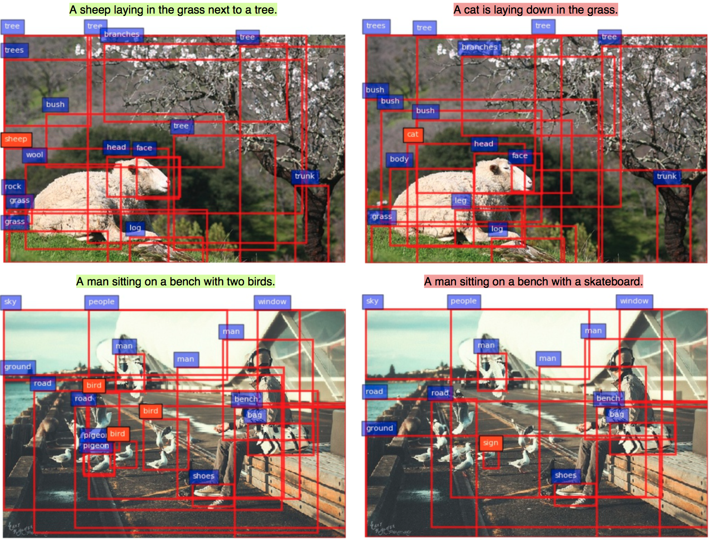

<h3 align="center">
<p>Pick-Object-Attack
</h3>

Implementation of [Pick-Object-Attack: Type-Specific Adversarial Attack for Object Detection](https://arxiv.org/abs/2006.03184):

Many recent studies have shown that deep neural models are vulnerable to adversarial samples: images with imperceptible perturbations, for example, can fool image classifiers.  In this paper, we present the first type-specific approach to generating adversarial examples for object detection, which entails detecting bounding boxes around multiple objects present in the image and classifying them at the same time, making it a harder task than against image classification.  We specifically aim to attack the widely used Faster R-CNN by changing the predicted label for a particular object in an image: where prior work has targeted one specific object (a stop sign), we generalise to arbitrary objects, with the key challenge being the need to change the labels of all bounding boxes for all instances of that object type.  To do so, we propose a novel method, named Pick-Object-Attack.  Pick-Object-Attack successfully adds perturbations only to bounding boxes for the targeted object, preserving the labels of other detected objects in the image. In terms of perceptibility, the perturbations induced by the method are very small.  Furthermore, for the first time, we examine the effect of adversarial attacks on object detection in terms of a downstream task, image captioning;  we show that where a method that can modify all object types leads to very obvious changes in captions, the changes from our constrained attack are much less apparent.

<p align="center">

</p>

### Reference
if you use our source code, please cite our paper:
```
@article{nezami2020pick,
  title={Pick-Object-Attack: Type-Specific Adversarial Attack for Object Detection},
  author={Nezami, Omid Mohamad and Chaturvedi, Akshay and Dras, Mark and Garain, Utpal},
  journal={arXiv preprint arXiv:2006.03184},
  year={2020}
}
```

### Install

1. Clone our repository
```buildoutcfg
git clone https://github.com/omidmnezami/pick-object-attack.git

```

2. Clone the bottom-up-attention repository and install the required libraries.
(You also need to download the pre-trained Faster-RCNN.)
```buildoutcfg
git clone https://github.com/peteanderson80/bottom-up-attention.git
```
 
 
### Run
```buildoutcfg
cd pick-object-attack/

# run the targeted attack (you need to change the paths of the pre-trained model & the config files as your local paths)
python script_run_targeted.py

# run the nontargeted attack
python script_run_nontargeted.py

```


https://github.com/peteanderson80/bottom-up-attention